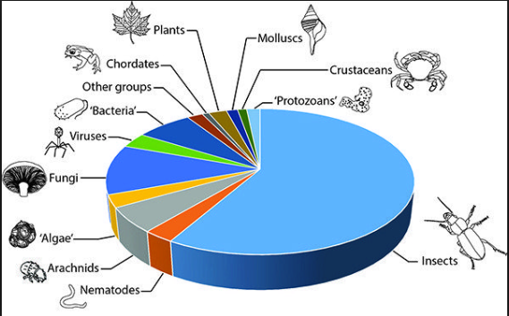

# Biodiversity Data Visualizations
## For Spatial Data
### 1 Maps with grids

### 2 The bubble plot (on a map)

### 3 Choropleth

A choropleth map (from Greek χῶρος "area/region" and πλῆθος "multitude") is a thematic map in which areas are shaded or patterned in proportion to the measurement of the statistical variable being displayed on the map, such as population density or per-capita income.

Choropleth maps provide an easy way to visualize how a measurement varies across a geographic area or show the level of variability within a region. A heat map is similar but does not use geographic boundaries.

### 4 Cartogram

A cartogram is a map in which some thematic mapping variable – such as travel time, population, or GNP – is substituted for land area or distance. The geometry or space of the map is distorted, sometimes extremely, in order to convey the information of this alternate variable. They are primarily used to display emphasis and for analysis as nomographs.
### 5 Dot distribution map

A dot distribution map, or dot density map, is a map type that uses a dot symbol to show the presence of a feature or a phenomenon. Dot maps rely on a visual scatter to show spatial pattern.
### 6 Thematic map

Thematic maps emphasize the spatial pattern of geographic attributes or statistics about places and relationships between places. For example, while a reference map might show the locations of cities, a thematic map might also represent the population of those cities. A reference map might show bank locations, while a thematic maps shows average income in an area. It’s the difference between mapping places and mapping data.

### 7 Contour line

A contour line (also isoline, isopleth, or isarithm) of a function of two variables is a curve along which the function has a constant value, so that the curve joins points of equal value. It is a plane section of the three-dimensional graph of the function f(x, y) parallel to the x, y plane. In cartography, a contour line (often just called a "contour") joins points of equal elevation (height) above a given level, such as mean sea level. A contour map is a map illustrated with contour lines, for example a topographic map, which thus shows valleys and hills, and the steepness or gentleness of slopes. The contour interval of a contour map is the difference in elevation between successive contour lines.

## Temporal
### 1 Bubble chart

### 2 Timeline

A timeline is a display of a list of events in chronological order. It is typically a graphic design showing a long bar labelled with dates paralleling it, and usually contemporaneous events; a Gantt chart is a form of timeline used in project management.
### 3 Gantt chart

A Gantt chart is a type of bar chart that illustrates a project schedule. This chart lists the tasks to be performed on the vertical axis, and time intervals on the horizontal axis. The width of the horizontal bars in the graph shows the duration of each activity. Gantt charts illustrate the start and finish dates of the terminal elements and summary elements of a project.

### 4 Stream Graph

A streamgraph, or stream graph, is a type of stacked area graph which is displaced around a central axis, resulting in a flowing, organic shape.

### 5 Nightingale Rose Chart

This chart was famously used by statistician and medical reformer, Florence Nightingale to communicate the avoidable deaths of soldiers during the Crimean war.

Nightingale Rose Charts are drawn on a polar coordinate grid. Each category or interval in the data is divided into equal segments on this radial chart. How far each segment extends from the centre of the polar axis depends on the value it represents. So each ring from the centre of the polar grid can be used as a scale to plot the segment size and represent a higher value. Therefore, it’s important to notice with Nightingale Rose Charts that it’s the area, rather than the radius of a segment that represents its value.

The major flaw with Nightingale Rose Charts is that the outer segments are given more emphasis because of their larger area size. This disproportionately represents increases in value.
### 6 Sankey Diagram

Sankey diagrams are a specific type of flow diagram, in which the width of the arrows is shown proportionally to the flow quantity.
### 7 Alluvial Diagram

Alluvial diagrams can also be used to illustrate patterns of flow on a fixed network over time. The Users Flow feature of Google Analytics uses alluvial diagrams to graphically represent how visitors move among the nodes (individual pages) on a web sites[citation needed].

## Taxonomic
### 1 Pie chart

### 2 Word Cloud

### 3 Bubble cloud

### 4 Bar chart, Radial bar chart

### 5 Dendrogram

A dendrogram is a diagram representing a tree. This diagrammatic representation is frequently used in different contexts:
### 6 Radial tree

A radial tree, or radial map, is a method of displaying a tree structure (e.g., a tree data structure) in a way that expands outwards, radially. It is one of many ways to visually display a tree,with examples extending back to the early 20th century. In use, it is a type of information graphic.
### 7 Hyperbolic tree

### Gauge

### Org Chart

### word tree chart

